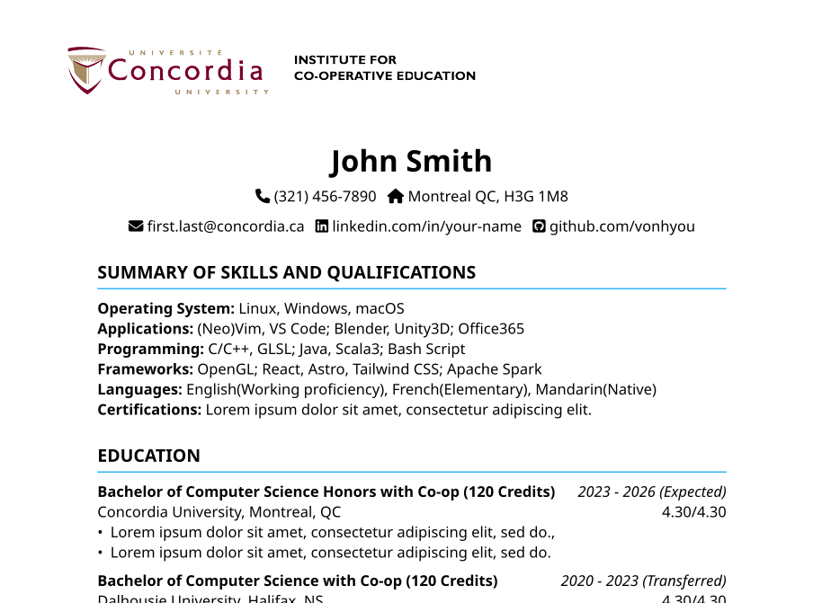

A modern, customizable CV template for Concordia University Co-op students, implemented in Typst.

> La [version française](./README-fr.md) est disponible.

## Features

- (Basically) 1 to 1 copy of the official template
- Available in English and French
- Utilizes FontAwesome icons for enhanced visual appeal
- Easy to customize and use with Typst

## Requirements

- [Typst](https://typst.app/)
- [fontawesome-typst](https://typst.app/universe/package/fontawesome/)
- [FontAwesome](https://fontawesome.com/download) fonts (Free version is sufficient)

## Usage

### Option 1: Online Typst App

1. Visit the [shared project link](https://typst.app/project/r36V3BAECA0emwXqFcOr5B)
2. Create your only copy of the project
3. Modify `cv-en.typ` (English) or `cv-fr.typ` (French) as needed

### Option 2: Local Compilation

0. Fork this repository
1. Clone this repository:
2. Install Typst and required fonts
3. Navigate to the project directory and compile:
   ```bash
   typst compile cv-en.typ demo/cv-en.pdf
   ```

   or use watch mode for auto-recompilation:
   ```bash
   typst watch cv-en.typ demo/cv-en.pdf
   ```

## Customization

Edit `cv-en.typ` or `cv-fr.typ` to personalize your CV. Refer to the [Typst documentation](https://typst.app/docs/) for advanced customization.

## Preview

A sample PDF output is available: [cv-en.pdf](./demo/cv-en.pdf)

## License

This project is licensed under the [GNU General Public License v3.0](LICENSE).

## Contributing

Contributions are welcome! Please feel free to submit a Pull Request.
